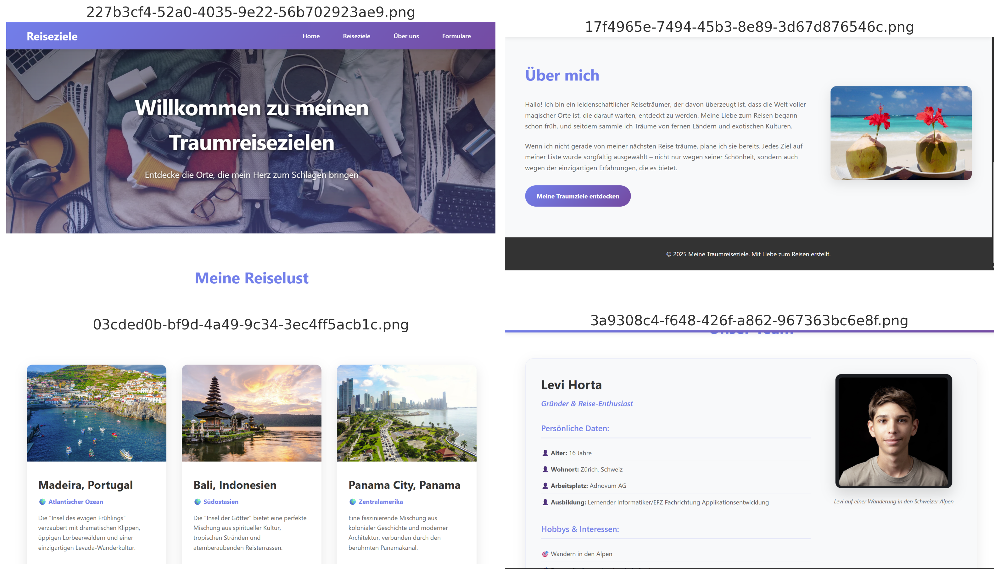

# Meine Traumreiseziele

## Projektbeschreibung

"Meine Traumreiseziele" ist eine persönliche Reise-Website, die drei aussergewöhnliche Reiseziele vorstellt: Madeira (Portugal), Bali (Indonesien) und Panama City (Panama). Die Website kombiniert persönliche Reiseträume mit detaillierten Informationen über jedes Ziel und bietet Besuchern Inspiration für ihre eigenen Reiseabenteuer. Neben den Reisezielen gibt es auch Informationen über das Team und verschiedene interaktive Formulare für Reiseplanung.

## Styleguide
[Zur Startseite](Styleguide.md)

## Wireframes

Die Website basiert auf diesen Hauptlayouts:

### Template - Einzelseitenansicht

Dieses Template wird für die Startseite und About-Us Seite verwendet und bietet eine klassische Einzelspalten-Darstellung mit Header, Hauptinhalt und Footer.

Ausserdem verwendet eine Raster-Darstellung für die Reiseziele und Team-Seiten, um Inhalte übersichtlich in Karten-Format zu präsentieren.

## Projektstruktur

\`\`\`
├── Grundaufbau/
│   └── README.md
├── Templates/
│   ├── wireframe.png
│   ├── template-1.html
│   └── template-2.html
├── bilder/
│   └── [verschiedene Bilder]
├── index.html
├── destinations.html
├── about_us.html
├── formulare.html
├── gallery.html
├── team.html
└── styles.css
